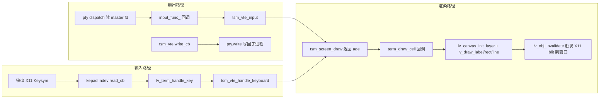

# `lv_term` 终端部件 · 架构设计与开发指导

> 面向学习者的架构文档。目标：把 GTK 版 `gtktsm` 前端改写为 LVGL 版，保留 `tsm_screen` / `tsm_vte` / `te::Pty` 底层，逐层理解每一层"为什么这样设计"。

## 1. 分层架构总览

```
┌──────────────────────────────────────────────────┐
│ L5 应用层 main.cpp                               │
│   · lv_x11_window_create 创建 X11 真实窗口        │
│   · lv_x11_inputs_create 注册键盘/鼠标/滚轮 indev  │
│   · 主循环: lv_timer_handler + pty.dispatch        │
├──────────────────────────────────────────────────┤
│ L4 部件层 src/terminal/lv_term.{h,cpp}            │
│   · lv_term_create: 创建 widget + canvas 子对象    │
│   · term_draw_cell: tsm_screen_draw 的每格回调     │
│   · 键盘/鼠标事件 → tsm_vte_handle_*               │
│   · LV_EVENT_RESIZED → tsm_screen_resize + resize │
├──────────────────────────────────────────────────┤
│ L3 LVGL 核心 3rdparty/lvgl                        │
│   · display(X11 驱动) / indev / timer / canvas    │
│   · 字体: tiny_ttf(等宽 TTF) 或内置 montserrat    │
├──────────────────────────────────────────────────┤
│ L2 终端核心 3rdparty/libtsm/src/tsm (C)               │
│   · tsm_screen: 网格状态 + 回卷缓冲 (scrollback)   │
│   · tsm_vte: ESC 控制序列状态机                    │
├──────────────────────────────────────────────────┤
│ L1 进程层 src/pty_process (C++)                   │
│   · te::Pty: posix_openpt + fork + execve shell   │
│   · dispatch 双向数据泵: read→input_func_→vte      │
├──────────────────────────────────────────────────┤
│ L0 子进程 shell (bash/zsh)                         │
└──────────────────────────────────────────────────┘
```

**设计原则**：L2/L1 完全不动（它们是稳定核心），所有改动集中在 L4 部件层与 L5 应用层。L3 只做配置开关（`lv_conf.h`），不改驱动源码。

## 2. 数据流（谁喂谁）



三条路径的触发时机：
- **键盘**：X11 键事件 → `x11_inp_event_handler` 填 `kb_buffer` → LVGL indev 轮询 read_cb → `LV_EVENT_KEY` 派发到焦点对象（term widget）→ 调 `tsm_vte_handle_keyboard`。
- **PTY 数据泵**：`lv_timer`(5ms) 周期调 `pty.dispatch()`；`Pty::read()` 读到数据后经 `input_func_` 回调 → `tsm_vte_input` 喂给状态机 → screen 更新 → 下一帧 `tsm_screen_draw` 重绘。
- **写回**：应用（如 shell 回显关闭时的控制序列）产生输出 → `tsm_vte` 的 `write_cb` → 转 `std::vector<std::byte>` → `Pty::write` 排队，`dispatch()` 里 `write()` 冲刷到 master fd。

## 3. 关键设计决策（含"为什么"）

### 3.1 渲染：用 `lv_canvas` 子对象，不用自写 draw 回调

- LVGL v9 移除了旧版 `LV_EVENT_DRAW` 自定义绘制钩子，官方推荐画布方案：在 term widget 下挂 `lv_canvas` 子对象，用 `lv_canvas_init_layer` 获得 `lv_layer_t`，然后用通用绘制 API（[`lv_draw_label`](3rdparty/lvgl/src/draw/lv_draw_label.h:188)、[`lv_draw_rect`](3rdparty/lvgl/src/draw/lv_draw_rect.h:229)、[`lv_draw_line`](3rdparty/lvgl/src/draw/lv_draw_line.h:102) 画字符、背景、下划线。
- 对比 GTK 版：GTK 用"CPU 渲染到影子 ARGB32 缓冲 + cairo blit"（[`gtktsm_renderer`](3rdparty/libtsm/src/gtktsm/gtktsm-terminal.c:519)）。LVGL 自带脏矩形 + `lv_refr` 机制（[`lv_refr.c`](3rdparty/lvgl/src/core/lv_refr.c)），**不需要**再写影子缓冲——这是移植时砍掉的一大块代码（约 500 行混合逻辑）。
- `tsm_screen_draw` 的回调签名（[`tsm_screen_draw_cb`](3rdparty/libtsm/src/tsm/libtsm.h:211)）：`(screen, id, ch, len, width, posx, posy, attr, age, data)`，回调里按 `tsm_screen_attr` 取前景/背景色，`inverse` 时交换 fg/bg，`underline` 画 1px 线。

### 3.2 字体：等宽 TTF（tiny_ttf），弃用内置 Montserrat

- 终端必须用**等宽字体**。[`config/lv_conf.h`](config/lv_conf.h:656) 里开的是 `LV_FONT_MONTSERRAT_14`，但 Montserrat 是**比例字体**（不同字符宽度不同），不能用于终端。
- 方案：开 [`LV_USE_TINY_TTF`](config/lv_conf.h:1035) + `LV_TINY_TTF_FILE_SUPPORT=1`（已改好），运行时 `lv_tiny_ttf_create_file("/usr/share/fonts/truetype/dejavu/DejaVuSansMono.ttf", 16)`（系统已装，`fc-list` 已确认）。
- cell 尺寸**不要硬编码**：用 `lv_font_get_line_height` 取行高，字宽用 `lv_font_get_glyph_dsc`（[`lv_font.h:173`](3rdparty/lvgl/src/font/lv_font.h:173)）量一个等宽字符（如 'M'）的 `adv_w`。bold/italic 后续可再加载 `DejaVuSansMono-Bold.ttf` / `DejaVuSansMono-Italic.ttf`（系统都有）。
- 学习要点：LVGL v9 的字体都是 `lv_font_t` 抽象，`get_glyph_dsc` / `get_glyph_bitmap` 是回调接口（[`lv_font.h:97`](3rdparty/lvgl/src/font/lv_font.h:97)），tiny_ttf 就是实现该接口的一个后端。

### 3.3 键盘：LVGL 通用 indev 丢失修饰键，终端需要增强方案

- LVGL 的 keypad indev 只传 `lv_key_t`（[`lv_group.h:35`](3rdparty/lvgl/src/core/lv_group.h:35)），**拿不到 Ctrl/Alt 修饰状态**。而终端必须有 Ctrl+C / Ctrl+D / Alt 组合键。
- 对比：GTK 版用 `gdk_keymap_translate_keyboard_state`（[`gtktsm-terminal.c:1375`](3rdparty/libtsm/src/gtktsm/gtktsm-terminal.c:1375)）拿到 keysym + 修饰位。
- **推荐设计**：不修改 LVGL X11 驱动源码（保持 L3 只读），而是给终端**自建一个 keypad indev**，`read_cb` 里直接读 X11 状态：
  1. `XQueryKeymap` 读当前按下的键 → `XKeysymToKeycode` / `XkbKeycodeToKeysym` 取 keysym；
  2. `XGetExtensionData`（Xkb 扩展）或 `XQueryKeymap` 的 modifier 位组合出 `mods`（`TSM_SHIFT_MASK`/`TSM_CONTROL_MASK`/`TSM_ALT_MASK`，见 [`tsm_vte_modifier`](3rdparty/libtsm/src/tsm/libtsm.h:354)）；
  3. `tsm_vte_handle_keyboard(vte, keysym, ascii, mods, unicode)`（[`libtsm.h:574`](3rdparty/libtsm/src/tsm/libtsm.h:574)）。
- keysym 常量直接复用 [`xkbcommon-keysyms.h`](3rdparty/libtsm/external/xkbcommon/xkbcommon-keysyms.h)（libtsm 已随工程带上，如 `XKB_KEY_BackSpace=0xff08`、`XKB_KEY_Left=0xff51`）。
- 若只想先跑最小版：可先用 `lv_x11_inputs_create` 的通用键盘 indev（只支持单键），Ctrl 组合键放到第二阶段。

### 3.4 鼠标选择

- 对比 GTK 版 `terminal_button_fn` / `terminal_motion_fn`（[`gtktsm-terminal.c:1421`](3rdparty/libtsm/src/gtktsm/gtktsm-terminal.c:1421)）。
- LVGL 版用指针 indev 的事件：`LV_EVENT_PRESSED` 记录起点 cell → `tsm_screen_selection_start`；`LV_EVENT_PRESSING` → `tsm_screen_selection_target`；`LV_EVENT_SHORT_CLICKED` 长按后 `tsm_screen_selection_copy` 复制。
- cell 坐标换算：`cell_x = px / cell_w`，`cell_y = py / cell_h`（term widget 局部坐标，用 `lv_obj_get_coord` 或事件里的指针位置减 widget 原点）。
- 鼠标跟踪模式（应用请求 mouse tracking）：`tsm_vte_set_mouse_cb`（[`libtsm.h:482`](3rdparty/libtsm/src/tsm/libtsm.h:482)）监听模式变化，再调 `tsm_vte_handle_mouse`（[`libtsm.h:577`](3rdparty/libtsm/src/tsm/libtsm.h:577)）。最小版可先跳过。

### 3.5 PTY 数据泵（补 `pty_process.cpp:235` 的 TODO）

- [`Pty::read()`](src/pty_process.cpp:211) 读到数据后调 `input_func_(pty, opaque, data)`（[`pty_process.h:15`](src/pty_process.h:15) 的 `InputFunc` 签名：`void(shared_ptr<Pty>, std::any opaque, std::vector<std::byte>)`）。
- main.cpp 传入的 `input_func`：把 `std::vector<std::byte>` 转 `char*` 调 `tsm_vte_input(vte, u8, len)`（[`libtsm.h:560`](3rdparty/libtsm/src/tsm/libtsm.h:560)）。
- 驱动方式：`lv_timer_create(term_idle_fn, 5, term)`，`term_idle_fn` 里 `d->pty.dispatch()` + `tsm_screen_draw` 重绘。
- 学习要点：`Pty::write()` 是非阻塞排队（`out_buf_` 队列 + `EAGAIN` 退避），`dispatch()` 每次冲刷一次；`read()` 也做了 2 次尝试。这是典型的**非阻塞 IO 轮询**模式，与 LVGL 的 `lv_timer` 事件模型天然契合。

### 3.6 子进程退出检测

- LVGL 没有 `g_child_watch`。设计：`term_idle_fn` 里 `waitpid(d->pty.get_child(), &status, WNOHANG)`，返回 >0 说明子进程退出 → `pty.close()`、发 `terminal-stopped` 事件（`lv_event_send`，[`lv_event.c`](3rdparty/lvgl/src/misc/lv_event.c)），主循环 `while (pty.is_open())` 自然结束 → `lv_deinit()`。
- 对比 GTK 版 `terminal_child_fn`（[`gtktsm-terminal.c:1956`](3rdparty/libtsm/src/gtktsm/gtktsm-terminal.c:1956)）。

### 3.7 窗口 resize

- X11 驱动的 `x11_event_handler` 已处理 `ConfigureNotify` → `lv_display_set_resolution`（[`lv_x11_display.c:265`](3rdparty/lvgl/src/drivers/x11/lv_x11_display.c:265)），显示尺寸变了。
- term widget 注册 `LV_EVENT_RESIZED` 回调：重算 `cols = w / cell_w`、`rows = h / cell_h` → `tsm_screen_resize`（[`libtsm.h:228`](3rdparty/libtsm/src/tsm/libtsm.h:228)）+ `Pty::resize`（[`pty_process.h:28`](src/pty_process.h:28)）+ 重设 canvas 缓冲尺寸（`lv_canvas_set_buffer` 重新分配，或删了重建 canvas）。
- 对比 GTK 版 `terminal_configure_fn`（[`gtktsm-terminal.c:1249`](3rdparty/libtsm/src/gtktsm/gtktsm-terminal.c:1249)），逻辑一一对应。

### 3.8 主循环与 tick

- X11 驱动自带 tick 线程（[`x11_tick_thread`](3rdparty/lvgl/src/drivers/x11/lv_x11_display.c:290) 每 5ms 调 `lv_tick_inc(5)`），**不要**再写 `lv_tick_set_cb` 或手动 `lv_tick_inc`（会双加）。
- 主循环（[`main.cpp`](src/main.cpp:23) 已就绪）：`lv_timer_handler()` 驱动 X11 事件定时器 + 终端 idle 定时器，`pty.dispatch()` 泵数据，`sleep 1ms` 限频。

## 4. 模块职责速查

| 模块 | 文件 | 职责 |
|---|---|---|
| 部件 | [`src/terminal/lv_term.h/.cpp`](src/terminal/) | widget 创建、draw 回调、键盘/鼠标、resize、生命周期 |
| PTY | [`src/pty_process.h`](src/pty_process.h) / [`pty_process.cpp`](src/pty_process.cpp) | PTY 打开/fork/数据泵（`read()` 里补 `input_func_` 调用） |
| 终端核心 | [`libtsm.h`](3rdparty/libtsm/src/tsm/libtsm.h) | `tsm_screen` 网格 + `tsm_vte` 状态机（不动） |
| LVGL 配置 | [`config/lv_conf.h`](config/lv_conf.h) | 开 `LV_USE_TINY_TTF` + `LV_TINY_TTF_FILE_SUPPORT`（已改） |
| 平台驱动 | [`lv_x11_display.c`](3rdparty/lvgl/src/drivers/x11/lv_x11_display.c) / [`lv_x11_input.c`](3rdparty/lvgl/src/drivers/x11/lv_x11_input.c) | X11 窗口、输入、tick（只读，不改） |

## 5. 学习路线（按依赖顺序）

1. **先读 L1**：`pty_process.cpp` 的 `Pty::open`（[`pty_process.cpp:20`](src/pty_process.cpp:20)）——`posix_openpt` + `fork` + 子进程 `init_child`/`setup_child`，理解 PTY 双向通道。
2. **再读 L2**：`tsm_screen_draw` 回调机制（[`tsm-screen.c`](3rdparty/libtsm/src/tsm/tsm-screen.c) 里按 `age` 增量绘制）与 `tsm_vte` 状态机（[`tsm-vte.c`](3rdparty/libtsm/src/tsm/tsm-vte.c)）。
3. **然后 L3**：`lv_canvas` + `lv_draw_label/rect/line` 的图层模型（[`lv_canvas.h:164`](3rdparty/lvgl/src/widgets/canvas/lv_canvas.h:164) `lv_canvas_init_layer`）。
4. **最后 L4/L5**：`lv_term` 部件把三条数据流接起来，`main.cpp` 负责平台窗口 + 主循环。

## 6. 实施里程碑（对应 todo）

```
[ ] M1 骨架: src/terminal/ 目录 + lv_term_create（todo 7）
[ ] M2 字体: tiny_ttf + DejaVu Sans Mono，cell 尺寸取自动字体度量（todo 8）
[ ] M3 渲染: term_draw_cell canvas 绘制回调（todo 9）
[ ] M4 键盘: 终端专用 keypad indev + X11 状态读取（todo 10）
[ ] M5 鼠标: 选择 + 复制（todo 11）
[ ] M6 数据泵: lv_timer 周期 pty.dispatch + 补 pty_process.cpp:235（todo 12）
[ ] M7 生命周期: waitpid 退出检测（todo 13）
[ ] M8 resize: LV_EVENT_RESIZED 全链路（todo 14）
[ ] M9 接线: main.cpp 全链路（todo 15）
```

每个里程碑都独立可运行验证：M1+M2+M3 完成后应能看到 shell 提示符；M4 完成后可键入命令；M6 完成后屏幕随 shell 输出刷新；M7/M8 是收尾。
