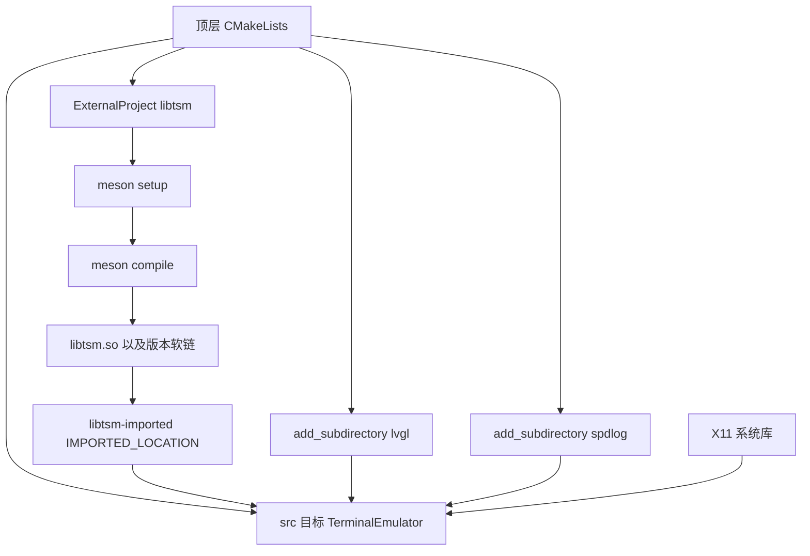
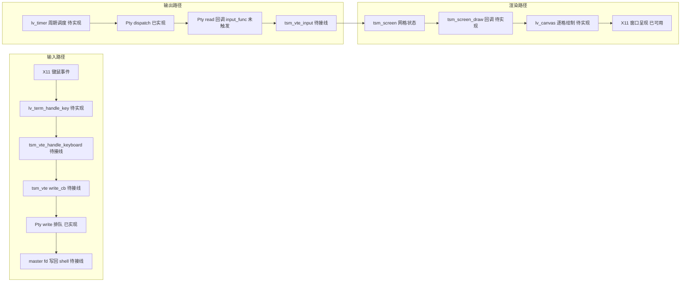

# TerminalEmulator 项目纵览

> 规划型文档：项目定位、构建链路、运行时架构、LVGL 配置盘点、缺口清单、待办与风险。
> 范围约定：只覆盖工程自身代码（`src/`、顶层 `CMakeLists.txt`、`config/lv_conf.h`）与第三方库的**接入方式**，不深入 `3rdparty/` 内部实现（仅在需要解释数据流时引用关键 API）。
> 关联文档：[`lvgl-terminal-port.md`](lvgl-terminal-port.md)（GTK → LVGL 移植方案）、[`lv-term-architecture.md`](lv-term-architecture.md)（分层架构与开发指导）、[`libtsm-cmake-fix.md`](libtsm-cmake-fix.md)（libtsm 链接问题，结论已由本文档第 4.5 节更正）。

## 1. 项目定位与当前状态

把 [`3rdparty/libtsm`](../3rdparty/libtsm/) 自带的 GTK 前端 `gtktsm` 改写为 **LVGL 版终端模拟器**，运行在 Linux 桌面的 X11 窗口里，复用 libtsm 的 `tsm_screen` / `tsm_vte` 与工程自研的 C++ `te::Pty`。

| 维度 | 现状 |
|---|---|
| 构建链路 | 已打通。干净构建 + 增量构建均成功，产出 `build/src/TerminalEmulator` |
| 可运行性 | 能起一个 800x600 的 X11 空窗口并进入 LVGL 事件循环 |
| 终端功能 | **未实现**。[`src/lv_term.cpp`](../src/lv_term.cpp:1) 只有 2 行，仅包含头文件 |
| PTY 接线 | **未接线**。[`te::Pty`](../src/pty_process.h:12) 已实现 PTY 生命周期与非阻塞 IO，但没有任何地方调用它，`input_func_` 回调也尚未触发（见 [`pty_process.cpp:235`](../src/pty_process.cpp:235) 的 TODO） |
| 输入处理 | 仅注册了 X11 通用输入设备，没有键位翻译、没有 Ctrl/Alt 修饰键处理 |

一句话总结：**骨架已在，业务未接**。工程的重心全部落在「实现 `lv_term` 部件并把 PTY ↔ 终端核心 ↔ LVGL 三条链路接起来」。

## 2. 技术栈与版本

| 组件 | 版本 / 说明 | 来源 |
|---|---|---|
| CMake | `>= 3.31` | [`CMakeLists.txt:1`](../CMakeLists.txt:1) |
| 生成器 | Ninja（VS Code CMake Tools 默认） | 构建日志 |
| 编译器 | GCC / G++（本机 15.2.0） | 构建日志 |
| C++ 标准 | C++20 | [`CMakeLists.txt:5`](../CMakeLists.txt:5) |
| LVGL | **9.5.0**，静态库 `liblvgl.a`，X11 驱动 | [`library.json:3`](../3rdparty/lvgl/library.json:3) |
| spdlog | 1.17.0，静态库 `libspdlogd.a`（Debug） | 构建日志 |
| libtsm | 4.7.1，由 **meson** 构建成 `libtsm.so.4.7.1` | [`meson.build:6`](../3rdparty/libtsm/meson.build:6) |
| meson | `>= 1.1`，需要预装在 PATH | [`meson.build:8`](../3rdparty/libtsm/meson.build:8) |
| 平台依赖 | X11（`libx11-dev`）、`libutil` | [`src/CMakeLists.txt:23`](../src/CMakeLists.txt:23) |

## 3. 目录结构

```
TerminalEmulator/
├── CMakeLists.txt          # 顶层：依赖接入 + libtsm ExternalProject
├── README.md               # 子模块、系统依赖、构建步骤
├── config/lv_conf.h        # LVGL 配置（工程唯一的 L3 配置改动点）
├── plans/                  # 规划与设计文档（本目录）
├── src/                    # 工程自有代码
└── 3rdparty/               # 子模块：lvgl / spdlog / libtsm
```

### 3.1 `src/` 文件明细

| 文件 | 行数 | 职责 |
|---|---|---|
| [`main.cpp`](../src/main.cpp:7) | 36 | 应用入口：`lv_init` → X11 窗口 → 输入注册 → `while(true) { lv_timer_handler(); sleep 1ms; }` |
| [`pty_process.h`](../src/pty_process.h:12) / [`pty_process.cpp`](../src/pty_process.cpp:11) | 52 / 297 | `te::Pty`：`posix_openpt` + `fork` + 子进程 `setsid`/`TIOCSCTTY`，非阻塞读写与 `out_buf_` 排队，`dispatch()`/`signal()`/`resize()` |
| [`lv_term.h`](../src/lv_term.h:11) / [`lv_term.cpp`](../src/lv_term.cpp:1) | 26 / 2 | 终端 widget 的 C 风格 API 声明（**实现为空**）：create / set_font / set_size / feed_input / handle_key / handle_mouse |
| [`misc.h`](../src/misc.h:3) | 40 | `CHECK_EXPR_RET/GOTO/EXIT_*` 宏：出错即 spdlog 记录并返回 / 跳转 / 退出 |
| [`CMakeLists.txt`](../src/CMakeLists.txt:12) | 35 | 可执行目标与链接；`SRCS` 只列 3 个 cpp（头文件不算源，`misc.h` 仅被 include） |

### 3.2 需要留意的小细节

- [`src/CMakeLists.txt:15`](../src/CMakeLists.txt:15) 与 [`:19`](../src/CMakeLists.txt:19) 的 `target_include_directories` / `target_link_directories` 是**空块**，include 路径完全依赖 `libtsm-imported` 的 `INTERFACE_INCLUDE_DIRECTORIES` 与 lvgl/spdlog 的导出目标。
- `target_link_libraries` 里的 [`util`](../src/CMakeLists.txt:30) 不是 CMake 目标（全仓无 `add_library(util)`），按 CMake 规则退化为**系统库 `-lutil`**。
- 目标名与库名混用：可执行目标叫 `TerminalEmulator`，而引入的库叫 `libtsm-imported`（带连字符的**手写** imported target，不是 `find_package` 产物）。

## 4. 构建系统

### 4.1 三个第三方依赖的接入方式

| 依赖 | 接入方式 | CMake 目标 | 产物 |
|---|---|---|---|
| lvgl | `add_subdirectory`（源码内嵌，构建期配置） | `lvgl::lvgl` | `build/3rdparty/lvgl/liblvgl.a` |
| spdlog | `add_subdirectory` | `spdlog::spdlog` | `build/3rdparty/spdlog/libspdlogd.a` |
| libtsm | **`ExternalProject_Add` + meson**（构建期外部构建，非 CMake 管理） | `libtsm-imported`（SHARED IMPORTED） | `build/libtsm-build/meson-build/src/tsm/libtsm.so` |

### 4.2 关键变量与开关（顶层 [`CMakeLists.txt`](../CMakeLists.txt:9)）

| 变量 | 值 | 作用 |
|---|---|---|
| `LIBTSM_SRC_DIR` | `${CMAKE_SOURCE_DIR}/3rdparty/libtsm` | meson 源目录 |
| `LIBTSM_BUILD_DIR` | `${CMAKE_BINARY_DIR}/libtsm-build/meson-build` | meson 构建目录，**产物落点** |
| `LV_BUILD_CONF_PATH` | `${CMAKE_SOURCE_DIR}/config/lv_conf.h`（`CACHE ... FORCE`） | 把工程配置注入 lvgl 构建 |
| `CONFIG_LV_BUILD_DEMOS` / `_EXAMPLES` / `_USE_THORVG_INTERNAL` | `OFF` | 关闭 lvgl 的 demo/example/ThorVG，缩短构建时间 |

### 4.3 构建命令与产物

```shell
cmake -S . -B build -G Ninja        # 配置
cmake --build build                 # 构建全部（556 个构建边）
./build/src/TerminalEmulator        # 运行，需有 X11 显示环境
```

| 产物 | 路径 |
|---|---|
| 可执行文件 | `build/src/TerminalEmulator` |
| libtsm 动态库 | `build/libtsm-build/meson-build/src/tsm/libtsm.so` → `libtsm.so.4` → `libtsm.so.4.7.1` |
| lvgl / spdlog 静态库 | `build/3rdparty/lvgl/liblvgl.a`、`build/3rdparty/spdlog/libspdlogd.a` |

### 4.4 构建依赖图



### 4.5 libtsm 接入复盘（本次修复，事实已实测）

**现象**：`cmake --build build` 在装载构建图时立即失败，未进入编译：

```
ninja: error: 'libtsm-build/meson-build/src/tsm/libtsm.so', needed by 'src/TerminalEmulator', missing and no known rule to make it
```

**根因**：[`libtsm-imported`](../CMakeLists.txt:16) 在**配置期**把 `.so` 登记为"已存在的库文件"，而该文件实际由 [`ExternalProject_Add(libtsm ...)`](../CMakeLists.txt:26) 在**构建期**产出。`add_dependencies(TerminalEmulator libtsm)`（[`CMakeLists.txt:33`](../CMakeLists.txt:33)）只提供**目标级顺序**，不会为文件建立生成规则，于是 Ninja 的规则图里出现"被需要但无人生成"的输入文件。

**修复**：在 `ExternalProject_Add` 中补一行声明产物（[`CMakeLists.txt:32`](../CMakeLists.txt:32)）：

```cmake
BUILD_BYPRODUCTS ${LIBTSM_BUILD_DIR}/src/tsm/libtsm.so
```

修复后 Ninja 生成了对应规则（`build/build.ninja`）：

```
build libtsm-build/src/libtsm-stamp/libtsm-build libtsm-build/meson-build/src/tsm/libtsm.so : CUSTOM_COMMAND libtsm-build/src/libtsm-stamp/libtsm-configure
```

**验证结果**：

| 检查项 | 结果 |
|---|---|
| 干净构建（删 `build/` 重新配置构建） | 通过，556/556，产出 `build/src/TerminalEmulator` |
| 增量构建 | 通过，meson 侧 `no work to do`，外部工程步骤正常完成 |
| 产物与 `IMPORTED_LOCATION` 一致性 | 一致，含 `libtsm.so` → `libtsm.so.4` → `libtsm.so.4.7.1` 软链 |
| 运行期查找 | 可执行文件带 `RUNPATH=build/libtsm-build/meson-build/src/tsm`，无需手工 `LD_LIBRARY_PATH` |
| `libtsm` 的 `werror=true` | 在本机 GCC 15.2 下未导致编译失败，暂不需要 `-Dwerror=false` |

### 4.6 构建层面遗留点（不影响当前进度，属健壮性）

- `libtsm.so` 已声明为 byproduct，但 `libtsm` 仍是 `BUILD_ALWAYS TRUE`（[`CMakeLists.txt:33`](../CMakeLists.txt:33)）且外部工程步骤为 `CUSTOM_COMMAND`，因此每次构建都会重跑一次外部工程的 build 步骤（meson 侧会 `no work to do`，开销小但非零）。
- **触发配置步骤的边界情况**：`CONFIGURE_COMMAND` 直接 `meson setup`，对**已配置**的目录重复执行会报 `Directory already configured`。目前靠 ExternalProject 的 configure stamp 只跑一次来规避；若只删 stamp 不删目录，会踩到。
- `INSTALL_COMMAND ""`（[`CMakeLists.txt:31`](../CMakeLists.txt:31)）表示不安装，运行期完全依赖构建目录中的 `RUNPATH`；一旦做打包/发布，需要改为 install + rpath/`$ORIGIN` 方案。
- 顶层未设置 `CMAKE_RUNTIME_OUTPUT_DIRECTORY` 等统一输出目录，产物分散在 `build/src`、`build/3rdparty/*`。
- CMake 对 GCC 15 + C++20 默认开启模块扫描，会把 `-fmodules-ts`、`-fmodule-mapper=...`、`-fdeps-format=p1689r5` 等 GCC 专有参数写进 `build/compile_commands.json`。clangd 不识别这些参数，会在编辑器中对 `src/*.h` 报 `Unknown argument`（工程本身并未使用 C++ 模块）。处理方式见第 7.3 节与 R10。

## 5. 运行时架构

### 5.1 分层

| 层 | 内容 | 现状 |
|---|---|---|
| L5 应用层 | [`main.cpp`](../src/main.cpp:7) | 已有：LVGL 初始化 + X11 窗口 + 输入注册 + 主循环（PTY 与终端部件均未接入） |
| L4 部件层 | [`lv_term.{h,cpp}`](../src/lv_term.h:11) | **仅有 API 声明**，实现待写 |
| L3 LVGL | `lvgl::lvgl` + X11 驱动 + `lv_conf.h` | 已接好，配置见第 6 节 |
| L2 终端核心 | `3rdparty/libtsm/src/tsm`（`tsm_screen` / `tsm_vte`） | 库已构建并链接成功，**代码里尚未 include**（[`main.cpp:5`](../src/main.cpp:5) 的 `#include "libtsm.h"` 仍是注释） |
| L1 进程层 | [`te::Pty`](../src/pty_process.h:12) | 已实现，未被调用 |
| L0 子进程 | shell（`$SHELL` 或 `/bin/sh`） | 待 `execve` 接线 |

### 5.2 目标数据流



三条路径的驱动方式（与 [`lv-term-architecture.md`](lv-term-architecture.md) 第 2 节一致）：

- **输入路径**：键盘/鼠标 → `lv_term_handle_key` / `lv_term_handle_mouse` → `tsm_vte_handle_keyboard` → vte 的 write 回调 → [`Pty::write`](../src/pty_process.h:26) 入队 → `dispatch()` 冲刷到 master fd。
- **输出路径**：`lv_timer` 周期调用 [`Pty::dispatch`](../src/pty_process.h:25) → `read()` 收到数据后必须触发 `input_func_`（当前 **未实现**，见 [`pty_process.cpp:232`](../src/pty_process.cpp:232)）→ `tsm_vte_input`。
- **渲染路径**：`tsm_screen` 状态更新 → `tsm_screen_draw` 逐格回调 → `lv_canvas` 绘制 → LVGL 脏矩形重绘到 X11 窗口。

### 5.3 当前实现程度小结

- 已具备：构建链路、X11 显示与输入注册、LVGL 事件循环、PTY 类本体、终端部件 API 签名。
- 待补齐：`lv_term` 实现（创建/绘制/键鼠/尺寸）、`Pty::read` 的回调触发、`Pty::open` 的调用方与子进程 `execve`、定时器调度、子进程退出检测、窗口 resize 全链路。

## 6. LVGL 配置盘点（[`config/lv_conf.h`](../config/lv_conf.h:1)）

| 配置项 | 值 | 对终端项目的影响 |
|---|---|---|
| [`LV_COLOR_DEPTH`](../config/lv_conf.h:30) | 32（XRGB8888） | 画布缓冲按 4 字节/像素计，800x600 约 1.92 MB，注意内存与带宽 |
| [`LV_DEF_REFR_PERIOD`](../config/lv_conf.h:91) | 33 ms | 默认约 30 fps 刷新节拍 |
| [`LV_USE_OS`](../config/lv_conf.h:110) | `LV_OS_NONE` | LVGL 单线程模型；X11 驱动自带 tick 线程，业务侧不要再手动 `lv_tick_inc` |
| [`LV_USE_STDLIB_MALLOC`](../config/lv_conf.h:43) / [`LV_MEM_SIZE`](../config/lv_conf.h:72) | `LV_STDLIB_BUILTIN` / 64 KB | **LVGL 自带堆仅 64 KB**，终端画布必须自行分配缓冲（`lv_canvas_set_buffer` 传入外部内存） |
| [`LV_USE_LOG`](../config/lv_conf.h:460) | 0 | LVGL 自身日志关闭，错误排查依赖工程侧的 spdlog |
| [`LV_USE_ASSERT_NULL`](../config/lv_conf.h:506) / `_MALLOC` | 1 / 1 | 保留轻量断言，便于早期发现空指针与分配失败 |
| [`LV_USE_X11`](../config/lv_conf.h:1282) | 1 | 提供 [`lv_x11_window_create`](../src/main.cpp:18) / `lv_x11_inputs_create`，链接需 `-lX11` |
| [`LV_USE_SDL`](../config/lv_conf.h:1270) / `WAYLAND` / `FBDEV` / `DRM` / `EVDEV` | 全 0 | 当前只走 X11 桌面路线 |
| [`LV_USE_TINY_TTF`](../config/lv_conf.h:1035) + [`LV_TINY_TTF_FILE_SUPPORT`](../config/lv_conf.h:1038) | 1 + 1 | 支持运行时从文件加载 TTF，配合 [`lv_term_set_font`](../src/lv_term.h:12) 用等宽字体（如 DejaVu Sans Mono） |
| [`LV_USE_FREETYPE`](../config/lv_conf.h:1024) | 0 | 不使用 FreeType 后端，字体统一走 tiny_ttf |
| [`LV_FONT_MONTSERRAT_14`](../config/lv_conf.h:656) | 1（其余为 0） | 仅保留最小内置字体；Montserrat 为比例字体，**不能用于终端网格** |
| [`LV_USE_FONT_PLACEHOLDER`](../config/lv_conf.h:708) | 1 | 缺字形时画占位块，避免渲染中断 |
| [`LV_CACHE_DEF_SIZE`](../config/lv_conf.h:547) | 0 | 图像缓存关闭（终端场景不依赖图片解码） |
| [`LV_USE_VECTOR_GRAPHIC`](../config/lv_conf.h:1053) / ThorVG | 0 / 0 | 不需要矢量图形栈 |
| [`LV_USE_QRCODE`](../config/lv_conf.h:1018) / `BARCODE` / `LODEPNG` / `SNAPSHOT` / `OBJ_PROPERTY` / `MATRIX` / `FLOAT` | 全 0 | 未启用的可选特性，保持精简 |

## 7. 缺口与待办

### 7.1 缺口清单

| 模块 | 现状 | 缺口 |
|---|---|---|
| 终端部件 | 只有头文件声明 | `lv_term_create` 及全部渲染/交互实现（目前无任何符号可链接） |
| PTY 回调 | `input_func_` 存了没用 | [`Pty::read`](../src/pty_process.cpp:211) 中补 `input_func_(...)` 调用；`write()` 目前只尝试 2 轮，尚无针对 `EAGAIN` 的重试调度 |
| 应用接线 | `main.cpp` 不涉及 PTY | 创建 `lv_term`、`Pty::open`、子进程 `execve` shell、主循环里 `dispatch()`、退出后清理 |
| 调度 | 无 `lv_timer` | 用 `lv_timer` 周期驱动 `Pty::dispatch` 与重绘 |
| 生命周期 | 无 | 子进程退出检测（`waitpid`）→ 关闭 PTY → 退出主循环（当前是 `while(true)` 死循环） |
| 尺寸联动 | 无 | 窗口 resize → 重算 cols/rows → `tsm_screen_resize` + [`Pty::resize`](../src/pty_process.h:28) + 画布重建 |
| 测试 | 无 | 全项目零测试；`lv_term` 的坐标换算、`Pty` 的排队逻辑都值得补单测 |

### 7.2 实施里程碑（与 [`lv-term-architecture.md`](lv-term-architecture.md) 第 6 节对齐）

| 里程碑 | 内容 | 可验证结果 |
|---|---|---|
| M1 | `lv_term` 骨架：widget + `lv_canvas` 子对象 + `tsm_screen`/`tsm_vte` 私有数据 | 空画布正确显示在窗口内 |
| M2 | 等宽字体：tiny_ttf 加载 DejaVu Sans Mono，cell 宽高由字体度量推导（不硬编码） | 打印 80x24 网格参考线 |
| M3 | 渲染：`tsm_screen_draw` 回调逐格绘制字符/背景/下划线/inverse | 能看到 shell 提示符 |
| M4 | 键盘：键位翻译（复用 xkbcommon keysym）+ 修饰键，调用 `tsm_vte_handle_keyboard` | 可在 shell 中键入命令 |
| M5 | 鼠标：选择起点/目标、复制 | 可框选并复制文本 |
| M6 | 数据泵：`lv_timer` 驱动 `dispatch()`，补 `Pty::read` 回调 | 屏幕随 shell 输出刷新 |
| M7 | 生命周期：子进程退出检测与清理 | 退出 shell 后程序正常结束 |
| M8 | resize：窗口尺寸变化全链路联动 | 拖动窗口后行列与 PTY 同步 |
| M9 | 整体接线：`main.cpp` 串起 L1–L5 | 端到端可用 |

### 7.3 基础设施待办（与业务解耦，可并行）

- 把 [`lv_term.{h,cpp}`](../src/lv_term.h:1) 的位置与 [`lv-term-architecture.md`](lv-term-architecture.md) 里规划的 `src/terminal/` 目录**统一**（二选一，见第 9 节）。
- `src/CMakeLists.txt` 中清理空块、明确 `util` 的用途或替换为显式的 `-lutil` 依赖。
- 引入最小测试框架（例如把 `lv_term` 的纯计算函数抽成可测单元），至少覆盖坐标换算与 PTY 排队。
- 统一输出目录与 Debug/Release 区分，便于后续打包。
- 消除 clangd 误报：在 [`.clangd`](../.clangd:1) 里用 `CompileFlags.Remove` 过滤 `-fmodules-ts`、`-fmodule-mapper=*`、`-fdeps-format=*`；或在顶层 `CMakeLists.txt` 设 `set(CMAKE_CXX_SCAN_FOR_MODULES OFF)`。二者取其一即可，后者还能略微加快配置与编译。

## 8. 风险清单

| # | 风险 | 影响 | 建议 |
|---|---|---|---|
| R1 | LVGL 自带堆仅 64 KB（[`LV_MEM_SIZE`](../config/lv_conf.h:72)），而 800x600 画布约 1.92 MB | 用 `lv_canvas` 内部缓冲会立刻分配失败 | 画布缓冲用 `new`/`std::vector` 自行分配并交给 `lv_canvas_set_buffer`；必要时评估 `LV_COLOR_DEPTH 16` 或按需裁剪画布尺寸 |
| R2 | LVGL 为单线程模型（`LV_OS_NONE`），而 X11 驱动有自带 tick 线程 | 误用线程操作 LVGL 对象会数据竞争 | 所有 LVGL 调用集中在主循环；不要再写 `lv_tick_set_cb`/手动 `lv_tick_inc`（[`main.cpp:11`](../src/main.cpp:11) 的注释块即为此） |
| R3 | 终端必须等宽字体，而配置里唯一启用的内置字体 Montserrat 是比例字体 | 字符错位、网格无法对齐 | 严格按 M2 走 tiny_ttf + 等宽 TTF；cell 尺寸一律由字体度量推导 |
| R4 | LVGL 通用 keypad indev 拿不到 Ctrl/Alt 修饰键 | 无法发送 Ctrl+C、Ctrl+D 等终端必备组合键 | 按 [`lv-term-architecture.md`](lv-term-architecture.md) 3.3 节自建 keypad indev 直读 X11 状态，不改 LVGL 驱动源码 |
| R5 | `libtsm.so` 由外部工程产出且不安装，运行期依赖 `RUNPATH` | 换机器/打包/移动构建目录后运行失败 | 打包阶段改为 install 到系统或使用 `$ORIGIN` 相对 rpath |
| R6 | libtsm 的 meson 构建开启了 `werror=true` | 更换编译器/升级工具链后第三方库构建可能中断 | 若出现构建失败，在 `CONFIGURE_COMMAND` 追加 `-Dwerror=false`（当前 GCC 15.2 未触发） |
| R7 | 外部工程配置命令对已配置目录不可重入 | 手工清理 stamp 后重新构建会报 `Directory already configured` | 保持"删 build 目录"的整体重建习惯，或改为 `meson setup --reconfigure` |
| R8 | 当前 `main.cpp` 是 `while(true)` 无退出条件 | 进程无法正常终止，无法做退出清理 | M7 接入子进程退出检测后改为条件退出 |
| R9 | 无任何自动化测试 | 渲染/坐标/IO 回归无保护 | 引入测试并在 CI（或本地脚本）中运行 |
| R10 | GCC 模块扫描参数进入 `compile_commands.json`，clangd 不识别 | 编辑器对 `src/*.h` 报假错误，掩盖真实问题 | 按第 7.3 节在 [`.clangd`](../.clangd:1) 过滤参数，或关闭 `CMAKE_CXX_SCAN_FOR_MODULES` |

## 9. 文档维护提示

1. [`libtsm-cmake-fix.md`](libtsm-cmake-fix.md) 的问题描述与根因分析已被实测推翻：真实根因是 `ExternalProject_Add` 缺少 `BUILD_BYPRODUCTS`（第 4.5 节），而非 meson 构建失败或 include 顺序问题。建议后续把该文档收敛为"历史排查记录"或直接以本文档第 4.5 节为准。
2. [`lv-term-architecture.md`](lv-term-architecture.md) 规划的新文件位于 `src/terminal/`，但仓库中实际已存在 [`src/lv_term.h`](../src/lv_term.h:1)（且 [`src/CMakeLists.txt:9`](../src/CMakeLists.txt:9) 已把 `lv_term.cpp` 列入 `SRCS`）。实施前必须二选一并统一：
   - **方案甲（改动小）**：沿用 `src/lv_term.{h,cpp}`，把文档里的路径改成 `src/`；
   - **方案乙（结构更清晰）**：新建 `src/terminal/` 并把现有头文件迁入，同时更新 `SRCS` 与 include 路径。
3. 本文档中标注"待实现/待接线"的条目，在 M1–M9 推进过程中应同步回写状态，避免文档与代码再次分叉。
